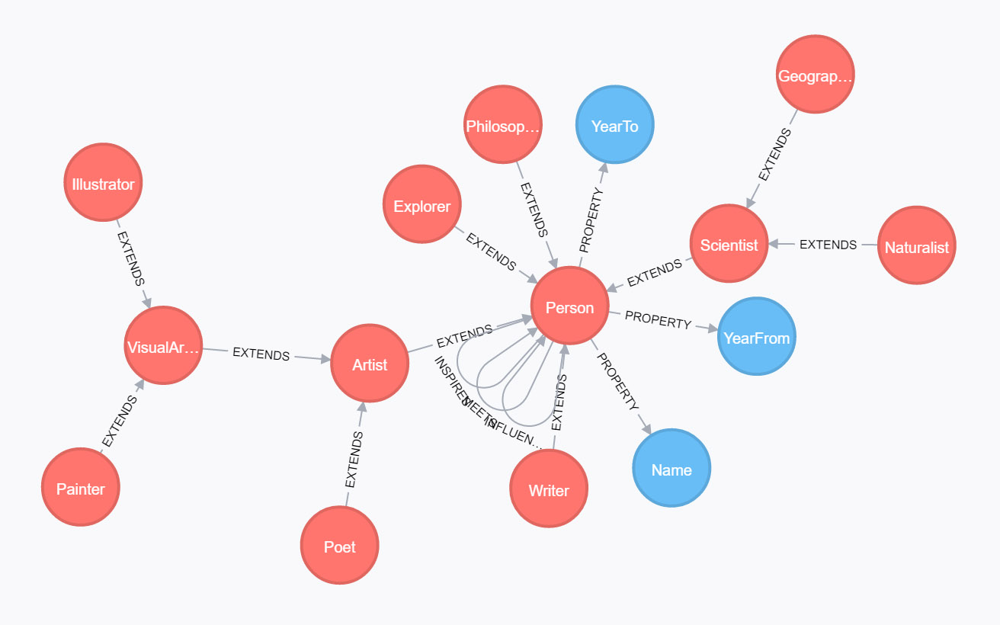

# Neo4j - GraphQL

An optimized  neo4j query resolver for Facebook's GraphQL.

## Prequisites

A neo4j graph database instance is required to provide the persistence layer. You can download this from the neo4j website http://neo4j.com/.

The methodology depends on having a schema defined in neo4j as follows:

Nodes with label ``class`` represent 'classes' which correspond to graphQL object types. Class nodes have ``property`` relationships with ``property`` nodes, and the combination of these properties defines the schema of the node. Class nodes can also have ``extends`` relationships with other class nodes, thereby inheriting properties from children. The resulting aggragate of properties translates to the graphQL object type.

The image below illustrates a possible structure, with the properties ``Name``, ``YearTo`` and ``YearFrom`` inherited by all ``Person`` types.

Data nodes are then linked to schema nodes by way of ``instance_of`` relationships. 

## Method

Rather than having to requery the database at each node for a graphQL query, the resolver builds a single neo4j query by iterating through the graphQL request. The result is extremely performant, and enables complex queries to be generated with the user friendly graphQL syntax.

